# Simulation of Tumor Fluorescence Time Profiles

This simulation can be run online [here]( https://mihaitodor.github.io/particle_simulation/index.html). For details, please consult the following paper:

> Daly, Harrison C.; Conroy, Emer; Todor, Mihai; Wu, Dan; Gallagher, William M; O'Shea, Donal (2019): An EPR Strategy for Bio-responsive Fluorescence Guided Surgery with Simulation of the Benefit for Imaging. ChemRxiv. Preprint. https://doi.org/10.26434/chemrxiv.11316227.v1

## Abstract

A successful matching of a PEG group size with the EPR effect for an *off-to-on* responsive NIR-fluorophore conjugate has been accomplished which allows two distinct *in vivo* tumor imaging periods, the first being the switch on during the initial tumor uptake via enhanced permeability into the ROI (as background is suppressed) and a second, later, due to enhanced retention within the tumor. Software simulation (https://mihaitodor.github.io/particle_simulation/index.html), synthetic chemistry, with *in vitro* and *in vivo* imaging have been synergistically employed to identify an optimal PEG conjugate of a bio-responsive NIR-AZA fluorophore for *in vivo* tumor imaging.

## Imaging simulation

The JavaScript framework Three.js https://threejs.org/ was used to build the central animation consisting of the chamber (FOV), inputs and output tubes, EPR zone, target region of interest (ROI) and fluorescent agent. Three.js makes it possible to author complex 3D WebGL-based https://www.khronos.org/webgl/ animations without the effort required for a traditional standalone computer application.  It provides a high-level application programming interface (API) which lets the user write code to create various 3D shapes (spheres, boxes, tubes), specify their properties (color, dimensions, position) and how they will move in the scene. The aspect and position of all Three.js shapes can be modified programmatically in real time using simple linear algebra transformations through various Three.js API calls.  Additionally, as needed, Three.js contains functionality to enable users to interact with the shapes or change the view in real time using input devices such as a mouse.

The data display chart was built using the JavaScript framework C3.js https://c3js.org/. C3.js provides a high level API for defining various chart properties and allows users to insert new data points programmatically while the animation is running.  It is built on top of a library called D3.js https://d3js.org/ that uses scalable vector graphics (SVG) browser technology for rendering and animating charts.  The side input menu, which lets users adjust and select various options for controlling the aspect of the animation and chart, was built using the dat.GUI.js https://github.com/dataarts/dat.gui JavaScript framework. This framework provides APIs for creating controls and adding JavaScript callbacks which alter the aspect and behavior of the animation and chart based on user input. It also enables the saving of configurations as a custom profile and exporting of results data shown in the plots as Excel CSV files.

The simulation can be accessed at https://mihaitodor.github.io/particle_simulation/index.html. The software code is available as open source on GitHub https://github.com/mihaitodor/particle_simulation and permits a user to modify and save revised versions.  The central animation components (FOV, EPR zone, ROI and tubes) are positioned statically within the Three.js scene. The user can use the mouse and keyboard to interact with this component ensemble and rotate it around by pressing the left click button, zoom in and zoom out by using the scroll wheel and, finally, drag it around by pressing the Ctrl key in combination with the left click button.

At the start of the animation, all the fluorescent agent particles are invisible and they are positioned at the injection site. Each of them is assigned a random velocity vector pointing towards the interior of the FOV.  After the initialization routine finishes, the particle animation starts immediately and the particles are released in batches of 100 in random directions every 5 frames.  Each frame, every visible particle’s position is advanced along the particle’s rectilinear trajectory by adding the particle’s velocity vector to its current position. Particles do not interact with each other. When a particle interacts with a surface, the following cases are possible:
- if a particle collides with one of the FOV’s boundary walls, it is reflected back;
- if the EPR zone is active and a particle inside it collides with its boundary surface, the particle is either reflected back or it can escape back into the FOV;
- if a particle is inside the ROI and it collides with its boundary surface, the particle is reflected back.

When the EPR zone is enabled, the trajectories of particles crossing it are influenced by a gravity-like effect, being directed towards the ROI. Due to this effect, most particles do not escape back into the FOV after they entered the EPR zone.  The velocity of particles in the EPR zone and in the ROI differs by a constant viscosity factor from the velocity in the FOV. The viscosity in the EPR zone is 0.9, thus the velocities of particles inside it are 0.1 x FOV velocities. The viscosity in the ROI is 0.155, so the velocities of particles inside it are 0.845 x FOV velocities.  Both the FOV and ROI have a configurable initial delay and clearance rate before fluorophore clearance commences. The clearance rates dictate how many random particles are selected from the FOV (every 20 frames) and how many are selected from the ROI (every 40 frames). The selected particles are positioned at the clearance site. For the purpose of clearance, when the EPR zone is enabled, particles inside it are considered as being in the FOV.  The % FOV / ROI distributions over time chart is updated each 30 frames. Depending on the performance of the system on which the simulation is running, the maximum number of frames per second is 60 (as can be observed in the FPS box in the top left corner), so the chart will be updated at most twice per second.

## Simulation interface

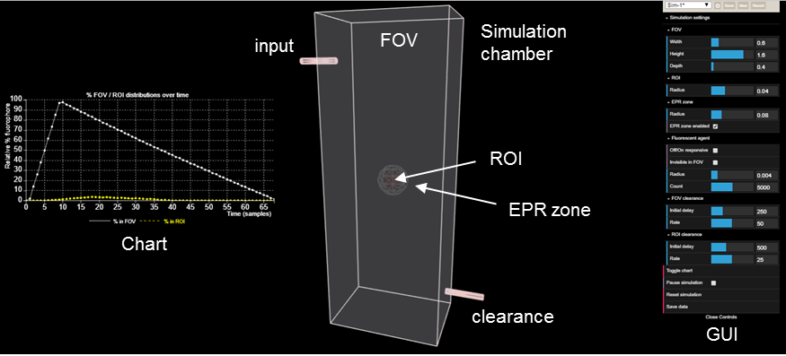

## Simulation GUI

<table>
    <thead>
        <tr>
            <th>Simulation variable features</th>
            <th>Simulation selections</th>
            <th>Simulation GUI</th>
        </tr>
    </thead>
    <tbody>
        <tr>
            <td>Relative FOV size</td>
            <td>width, height, depth; FOV can be reoriented during simulation by holding down and moving cursor</td>
            <td rowspan="14"> 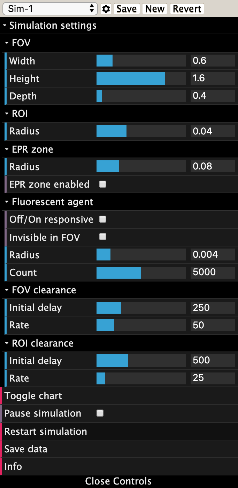</td>
        </tr>
        <tr>
            <td>Relative ROI size</td>
            <td>radius</td>
        </tr>
        <tr>
            <td>Relative EPR zone size</td>
            <td>radius</td>
        </tr>
        <tr>
            <td>EPR zone enabled</td>
            <td>optionality toggle</td>
        </tr>
        <tr>
            <td>Flu <i>off</i>/<i>on</i> response</td>
            <td>optionality toggle</td>
        </tr>
        <tr>
            <td>Flu agent invisible in FOV</td>
            <td>optionality toggle allowing off fluorescent agent in FOV to be completely hidden</td>
        </tr>
        <tr>
            <td>Fluorescent agent size</td>
            <td>radius</td>
        </tr>
        <tr>
            <td>Flu. agent quantity</td>
            <td>1-10,000</td>
        </tr>
        <tr>
            <td>FOV clearance parameters </td>
            <td>initial clearance delay relative rate of clearance</td>
        </tr>
        <tr>
            <td>ROI clearance parameters</td>
            <td>initial clearance delay relative rate of clearance</td>
        </tr>
        <tr>
            <td>Chart showing relative % of fluorophore in FOV and ROI over time</td>
            <td>real-time data plots tracking simulation; charts can be hidden during simulation by toggle function</td>
        </tr>
        <tr>
            <td>Pause simulation</td>
            <td>simulation can be paused and restarted at any stage</td>
        </tr>
        <tr>
            <td>Restart simulation</td>
            <td>click revert to reset to original settings</td>
        </tr>
        <tr>
            <td>Save data</td>
            <td>exported as csv file</td>
        </tr>
    </tbody>
</table>

## Preset simulations

Simulation                                                                      | Clearance inputs
------------------------------------------------------------------------------- | -------
Sim-1 - always-on / Sim-3 - off/on responsive 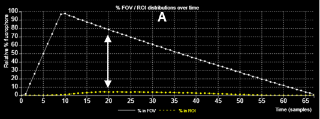 | FOV: Initial delay: 250; Rate: 50   ROI: Initial delay: 500; Rate: 25
Sim-2 - always-on / Sim-4 - off/on responsive 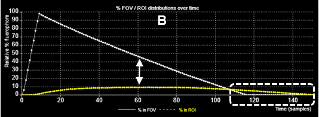 | FOV: Initial delay: 250; Rate 25   ROI: Initial delay: 750; Rate 10
Sim-5 - always-on / Sim-6 - off/on responsive 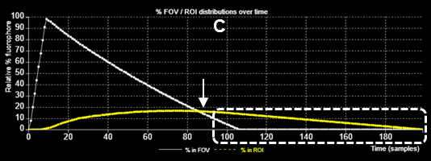 | EPR zone activated   FOV: Initial delay: 250; Rate 25   ROI: Initial delay: 750; Rate 10

Simulation | Preview
---------- | -----------------------------
Sim-1      | 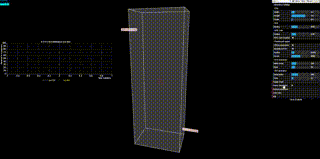
Sim-2      | 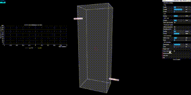
Sim-3      | 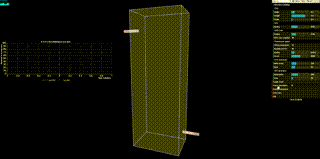
Sim-4      | 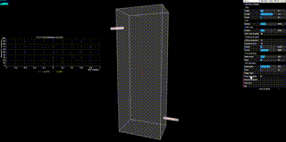
Sim-5      | 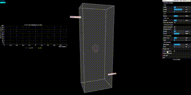
Sim-6      | 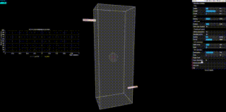

© [Department of Chemistry RCSI](https://www.rcsi.com/dublin/about/faculty-of-medicine-and-health-sciences/academic-departments/chemistry) 2019